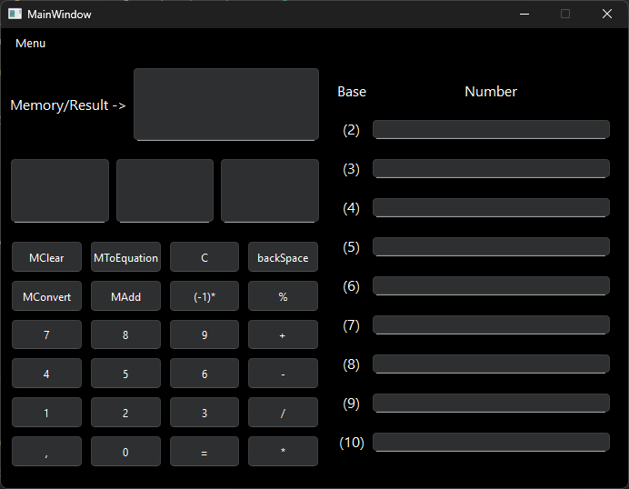

# Qt Calculator - Documentation

## Features
- **Mathematical operations**:
    - Addition, subtraction, multiplication, division
    - Modulo
    - Change the sign of the number
- **Number system conversion**:
    - (2–10)
- **Memory management**:
    - Save/restore values
    - Clear memory

## Code structure
- **Main classes**:
    - `MainWindow` – user interface
    - `calculator` – calculation logic
- **Files**:
    - `mainwindow.h/cpp` – GUI and event handling
    - `calculator.h/cpp` – mathematical operations and conversions
    - `main.cpp` – entry point

## Interface
- **Menu**:
    - `About the author`
- **Displays**:
    - Main (`display`)
    - Operation (`displayOperation`)
    - Memory (`displayMemory`)
- **Numeric buttons**:
    - (`digit_1` – `digit_10`)
- **Operation buttons**:
    - (`addition`, `subtraction`, etc.)

## Author
**Leon Pawlowski**  
Student ID: 287089
