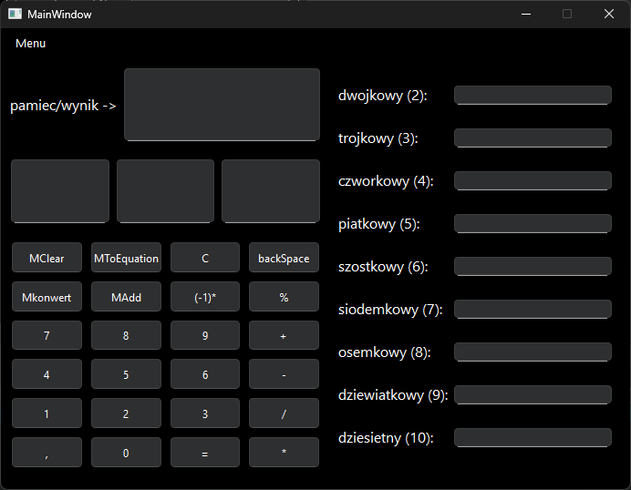
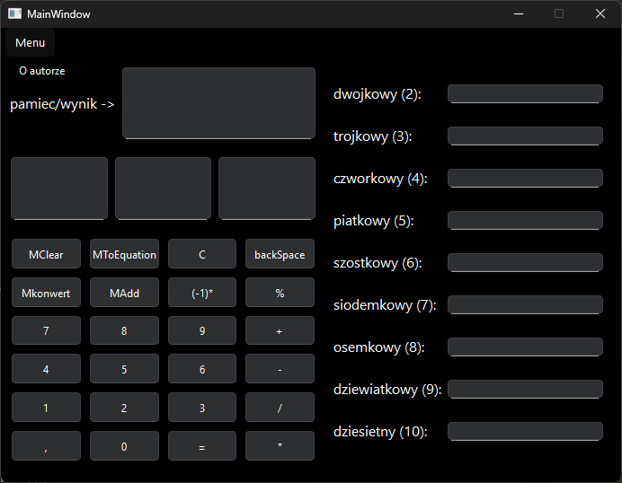

# Kalkulator Qt - Dokumentacja

 

## Funkcjonalnosci
- **Operacje matematyczne**:
    - Dodawanie, odejmowanie, mnozenie, dzielnie
    - Reszta z dzielenia
    - Zmiana znaku liczby
- **Konwersja systemow liczbowych**:
    - (2-10)
- **Zarzadzanie pamiecia**:
    - Zapisywanie/odtwarzanie wartosci
    - Czyszczenie pamieci

## Struktura kodu
- **Glowne klasy**:
    - `MainWindow` - interfejs uzytkownika
    - `kalkulator` - logika obliczen
- **pliki**:
    - `mainwindow.h/cpp` - GUI i obsluga zdarzen
    - `kalkulator.h/cpp` - operacje matematyczne i konwersje
    - `main.cpp` - punkt wejscia

## Interfejs
- **Menu**:
    - `O autorze`
- **Wyswietlacze**:
    - Glowny (`wyswietlacz`)
    - Operacji (`wyswietlaczOperacji`)
    - pamieci (`wyswietlaczPamieci`)
- **Przyciski numeryczne**:
    - (`cyfr_1` - `cyfr10`)
- **Przycisk operacji**:
    - (`dodawanie`, `odejmowanie`, itp.)

## Autor
**Leon Pawlowski**
Nr indeksu: 287089